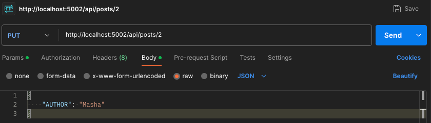
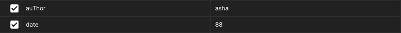
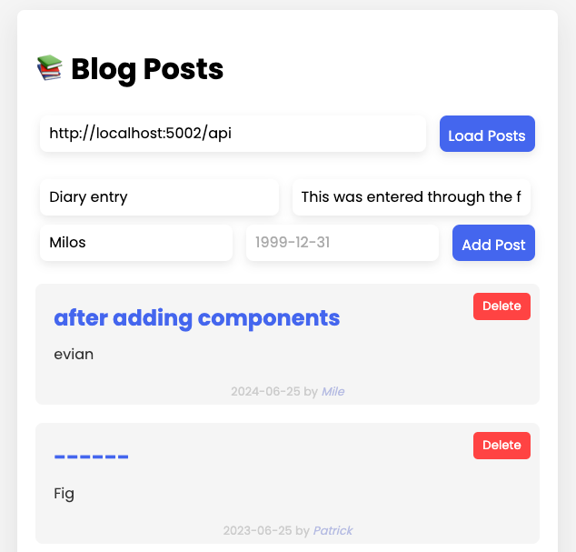

# masterblog_api
Welcome to my project page!
## Introduction
This is an exercise in creating CRUD+ for a blog application's API endpoints with the help of Flask microframework,
and establishing a JS frontend which taps into select endpoints.

### Tags
`html` `css` `JS` `python` `flask` `server-side` `client-side` `API` `endpoint`

### Project features
* endpoint routing
* json db management
* templating / dynamic webpage generation via JS and Jinja2
* 
* error management / jsonified return values and status codes

## Installation

To install this project, clone the repository and install the dependencies listed in requirements.txt. If on Windows, rely on `pip` rather than pip3.

```bash
  pip3 install -r requirements.txt
```

## Usage/Examples

### Instructions

1. Run backend/backend_app.py and frontend/frontend_app.py simultaneously.

From here on out you can choose to interact with the frontend (limited interface) or with  the backend via postman.
The frontend is running on port 5001. The backend is running on port 5002. 

#### Webpage instructions
1. Paste `http://127.0.0.1:5001/` in the URL bar of a browser
2. The URL and the port to "Load Posts" from is `http://localhost:5002/api`
3. You are able to view posts, add posts and delete posts.
#### Postman instructions
##### "List" endpoint
Set the request to **GET**. Paste `http://localhost:5002/api/posts` in Postman's URL bar and send.
##### "Add" endpoint
Set the request to **POST**, navigate below the URL bar to body, then below that to raw, set to JSON from the dropdown and
enter a JSON-format dictionary like so (case-insensitive):
```json
{
  "title": "<your title>",
  "content": "<content of your blog post>",
  "author": "<name of the author>",
  "date": "ideally <YYYY-MM-TT> for sorting purposes, but you can enter anything"
}
```
Send. A unique ID will be generated, which will be visible in the returned JSON upon success, as well as when you make
a GET request to the "List" endpoint in the future. The ID is crucial to successfully deleting/updating a post.
##### "Delete" endpoint
Set the request to **DELETE** and paste the following into Postman's URL bar:
`http://localhost:5002/api/posts/<ID of the post to delete>`. Send.
##### "Update" endpoint
Set the request to **PUT** and paste the following into Postman's URL bar:
`http://localhost:5002/api/posts/<ID of the post to update>`.

Navigate below the URL bar to body, then below that to raw, set to JSON from the dropdown and 
enter a JSON-format dictionary like so:
```json
{
  "content": "<your updated content>",
}
```
Send. Feel free to only include the fields which are being updated. The ID will be retained.
##### "Search" Endpoint
Set the request to **GET** and paste this URL into Postman's URL bar: `http://localhost:5002/api/posts/search?`.
In the 'Params' tab, include blog post fields to search for (case-insensitive). They will be automatically formatted
into the query string.

Send. The search returns all entries which match ANY of the criteria, rather than only returning entries
which match all of them. 
##### "Sort" Endpoint
This is just the **"List"** endpoint with optional sorting parameters.
Set the request to **GET**. Paste `http://localhost:5002/api/posts` in Postman's URL bar. In the 'Params' tab, include
keys `sort` and/or `direction`. As the value for the sort key, enter a blog post field (title, author, content, date)
other than ID. Optionally, specify the `direction` as `asc` or `desc` based on preference. If only a `direction` key is
included, without `sort`, then the specified direction will apply to blog post IDs. 


### Frontend demo screenshot:



## Feedback

If you have any feedback, please reach out to me @MilosTadic01


## License

[CC0 1.0 Universal](https://choosealicense.com/licenses/cc0-1.0/)


